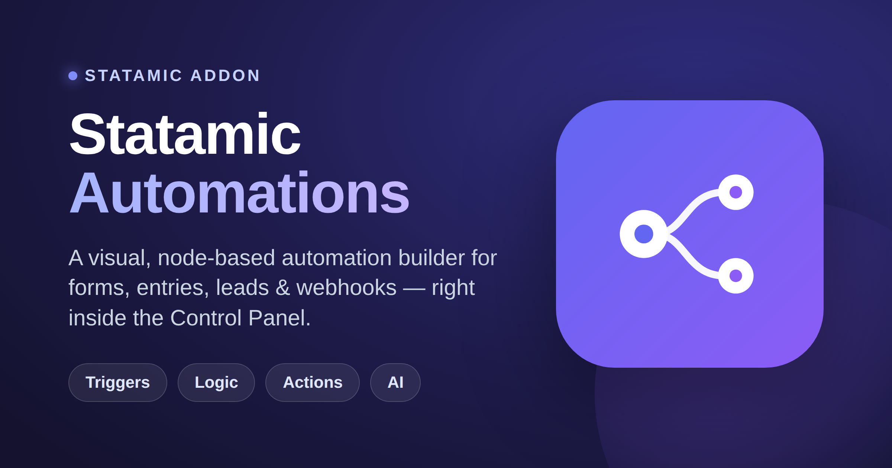
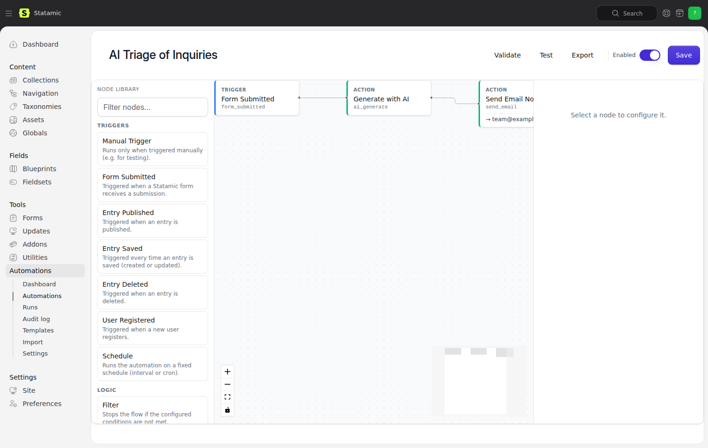
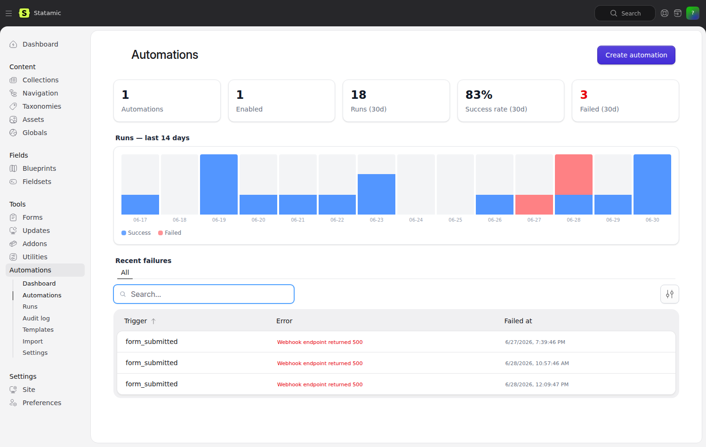
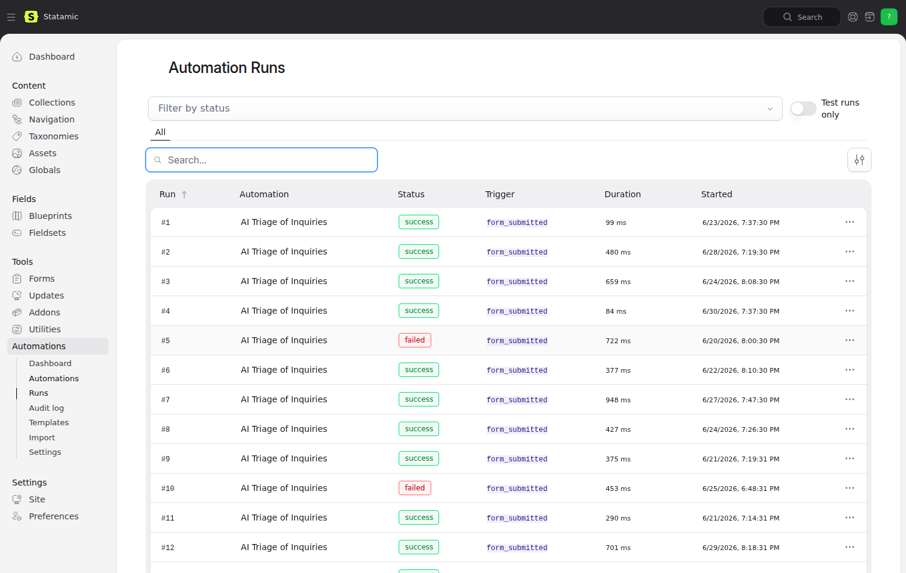

<div align="center">



# Statamic Automations

**A visual automation layer built specifically for Statamic websites.**

[](https://packagist.org/packages/goldnead/statamic-automations)
[](LICENSE)
[](https://statamic.com)
[](https://github.com/goldnead/statamic-automations/actions/workflows/tests.yml)
[](https://github.com/goldnead/statamic-automations/actions/workflows/build.yml)
[](https://github.com/goldnead/statamic-automations/actions/workflows/lint.yml)

Build automations for Statamic forms, entries, leads and webhooks  
— with a familiar visual flow builder inside the Control Panel.

</div>

---

> Statamic Automations gives your site a lightweight visual workflow builder. Create automations from forms, content events, LeadHub contacts and webhooks — without writing a custom Laravel listener for every small process.
>
> Build flows with **Trigger**, **Filter**, **Branch** and **Action** nodes, test them with real sample data, and inspect every run with node-by-node logs.
>
> _It's not a full n8n replacement. It's the **missing automation layer** for Statamic websites._



<p align="center">
  
  
</p>

## Why this exists

Statamic is wonderful as a CMS and developer framework, but typical website automations still demand:

- custom Laravel events + listeners
- hand-rolled webhooks
- third-party tools like Zapier / Make / n8n
- opaque "what just happened?" lead and form pipelines

For most Statamic projects an external automation tool is overkill, and custom code for every small workflow is expensive to maintain. **Statamic Automations** sits exactly in that gap.

## Features

- 🎨 **Visual node-based flow builder** inside the Control Panel
- ⚡ **Triggers** for forms, entries, assets, users, leads and webhooks
- 🔀 **Filter** and **Branch** nodes for simple logic
- 🛠 **Actions** for emails, webhooks, LeadHub updates and Statamic changes
- 🪄 **Token picker** for using event data in actions (`{{ form.email }}`, `{{ lead.full_name }}` …)
- 🧪 **Test runs** with real sample data — no real side-effects in test mode
- 📋 **Node-by-node execution logs** with redacted sensitive payloads
- 🧩 Optional **Webhook Manager** + **LeadHub** integrations (auto-detected, never required)
- 📦 **Templates** that copy into user-owned automations
- 📤 **JSON export / import** for version control, starter kits and cross-environment moves
- 👨‍💻 Public **developer API** for custom triggers, actions and conditions

## Requirements

- PHP **8.2+**
- Laravel **12.x** or **13.x**
- Statamic **6.x**
- `goldnead/statamic-brand-context` — a hard runtime dependency, not optional. Every
  automation, run and audit entry is scoped to a brand, and handles are unique per brand
  rather than per install. Until that package is on Packagist, `composer require` cannot
  resolve it from this package alone: a `repositories` block declared inside a dependency
  is ignored by Composer, only the root project's is read.

## Installation

```bash
composer require goldnead/statamic-automations
php artisan migrate
```

That's it. The addon ships its compiled Control Panel assets (Inertia + Vue 3)
under `resources/dist/build/`, and Statamic publishes them to your site's
`public/vendor/statamic-automations/` automatically on install — **there is no
end-user build step.**

Optionally publish the config to customise defaults:

```bash
php artisan vendor:publish --tag=statamic-automations-config
```

> **Developing the addon?** The frontend is built with the official Statamic 6
> Vite convention (`@statamic/cms/vite-plugin`). From a clone, run
> `composer install && npm install && npm run build`, or use
> `scripts/setup-playground.sh` to spin up a full Statamic 6 playground.

Make sure your queue worker is running so automation runs are dispatched off the request thread:

```bash
php artisan queue:work --queue=default
```

## Quick start

1. Open the Statamic CP and navigate to **Automations**.
2. Click **New automation**.
3. Click the **+** on the empty canvas, then pick a **Trigger** (e.g. _Form Submitted_)
   from the node library on the left. The canvas lays nodes out for you — you never drop
   one onto free space, and you never draw a connection by hand.
4. Click the **+** below the trigger to add **Filter** or **Branch** nodes if you need
   conditions, then **Action** nodes (e.g. _Send Email_). Each node is wired to the **+**
   you clicked, so the flow connects itself.
5. To insert a node between two existing ones, click the **+** that sits on the edge
   between them.
6. Click **Validate** then **Test** with sample data.
7. Toggle **Enabled** when ready — the automation now runs against real events.

Or skip steps 2–5 and start from a **template**: the eight most common patterns ship as
one-click installs, each copied into an automation of your own that addon updates never
touch.

## Built-in nodes

### Triggers

| Trigger | Group | Source |
|---|---|---|
| Manual Trigger | Manual | For testing & ad-hoc runs |
| Form Submitted | Statamic | A Statamic form receives a submission |
| Entry Published | Statamic | An entry is published |
| Lead Created _(LeadHub)_ | LeadHub | A new lead is added |
| Lead Status Changed _(LeadHub)_ | LeadHub | A lead transitions between statuses |
| Lead Tag Added _(LeadHub)_ | LeadHub | A tag is added to a lead |
| Lead Note Added _(LeadHub)_ | LeadHub | A note is added to a lead |
| Lead Follow-up Due _(LeadHub)_ | LeadHub | A scheduled follow-up becomes due |

### Logic

| Node | Purpose |
|---|---|
| Filter | Stop the flow if conditions aren't met |
| Branch | Split into `true` / `false` paths |
| Stop | End the flow with status `stopped` |
| Delay | Wait for minutes / hours / days, then continue |

### Actions

| Action | Group | Notes |
|---|---|---|
| Send Email Notification | Notifications | Token-resolved subject + body |
| Send Webhook (Simple) | HTTP | Direct POST/PUT/PATCH |
| Send Webhook _(via Webhook Manager)_ | Webhook Manager | Inherits transport, signing, retry, logs |
| Add Log Entry | Utilities | Writes to your Laravel log channel |
| Create / Update Entry | Statamic | Create or edit an entry from token-resolved data |
| Publish / Unpublish / Delete Entry | Statamic | Change or remove an entry by id |
| Create Term | Statamic | Add a taxonomy term |
| Create / Update User | Statamic | Create or merge field data on a user |
| Assign User Role · Add User to Group | Statamic | Add/remove a role or group membership |
| Set Global Value | Statamic | Set a key on a global set (per site) |
| Stop Flow | Logic | Ends the flow intentionally |
| Create or Update Lead _(LeadHub)_ | LeadHub | Email-based upsert |
| Change Lead Status _(LeadHub)_ | LeadHub | |
| Add / Remove Lead Tag _(LeadHub)_ | LeadHub | |
| Add Lead Note _(LeadHub)_ | LeadHub | Token-resolved body |
| Create / Complete Follow-up _(LeadHub)_ | LeadHub | |

## Templates

Eight curated templates ship with the addon — each one is **copied** into a user-owned automation when installed, so updates to the addon never silently change your existing flows.

- **New Lead Notification** — email the admin when a LeadHub lead is created
- **Form Submission to Webhook** — forward submissions to an external URL
- **Qualified Lead to CRM** — push qualified leads + add note + schedule follow-up
- **Workshop Inquiry Flow** — capture, tag, notify, schedule follow-up
- **Lead Magnet Delivery** — send the file, create a tagged lead, log the delivery
- **Follow-up Reminder** — daily reminders for due follow-ups
- **Entry Published Notification** — webhook on collection publish (Slack-friendly)
- **Webhook Failure Alert** — admin email when a destination keeps failing

## Works with

Automations is the **orchestration layer** in a small family of addons. Each one owns a different concern:

- **statamic-automations** — orchestration: multi-step workflows (triggers → conditions → actions) built visually in the CP.
- **[statamic-webhook-manager](https://github.com/goldnead/statamic-webhook-manager)** — transport: reliable HTTP in and out (delivery, retries, auth, signing, logging). Automations can delegate its webhook delivery to it.
- **[statamic-leadhub](https://github.com/goldnead/statamic-leadhub)** — CRM: contacts, follow-ups and opportunities whose events become automation triggers.

Note that both Automations and Webhook Manager can react to the same Statamic events (e.g. an entry save). Pick **one place per concern**: if a save should just fire a webhook, configure it in Webhook Manager; if it should run a multi-step workflow, build it here — don't wire the same event in both.

## Optional integrations

Sister addons are detected automatically through `class_exists`. The package keeps working without them.

| Integration | Class | Adds |
|---|---|---|
| Webhook Manager | `Goldnead\WebhookManager\Facades\WebhookManager` | "Send Webhook (via Webhook Manager)" action with Webhook Manager destinations |
| LeadHub | `Goldnead\Leadhub\Facades\LeadHub` | 5 LeadHub triggers + 7 LeadHub actions |

Class names are configurable in `config/automations.php` under `integrations`, so you can swap implementations or use a fork.

## Extending Automations

The addon exposes a full public extensibility API. A third-party addon (or your host app) registers custom nodes and data sources from any service provider's `boot()` — the very same surface the built-ins are registered through. Server-registered nodes appear in the CP node library with **no frontend build**, and their `schema()` becomes the config form automatically.

```php
use Goldnead\StatamicAutomations\Facades\Automations;

public function boot(): void
{
    // Nodes — handle-less overload reads ::handle() from the class.
    Automations::registerAction(SendToInternalApiAction::class);
    Automations::registerTrigger(InvoicePaidTrigger::class);
    Automations::registerLogicNode(BusinessHoursGate::class);

    // Populate a custom <select> picker (options_source: 'shop.products').
    Automations::registerOptionSource('shop.products', fn ($request) =>
        \App\Models\Product::all()->map(fn ($p) => ['value' => $p->id, 'label' => $p->name])->all()
    );

    // Turn any application event into a trigger — one call registers the node
    // AND subscribes a listener that funnels the event into the dispatcher.
    Automations::registerEventTrigger(\App\Events\OrderShipped::class, [
        'handle' => 'order_shipped',
        'label' => 'Order Shipped',
        'group' => 'Shop',
        'payload' => 'order',                                   // → {{ order.id }}
        'output_schema' => ['order' => ['id' => 'string', 'total' => 'number']],
    ]);
}
```

Custom **actions** implement `AutomationAction`, **triggers** `AutomationTrigger`, **logic nodes** `AutomationLogicNode` (all extend the shared `AutomationNode`). Event triggers can also be declared config-only in `config/automations.php` under `event_triggers`. A malformed registration throws immediately (`Automations::describe()`), never silently no-ops.

Full documentation — interface definitions, the schema-field vocabulary, option-source reference and worked copy-paste examples for every extension point — lives at <https://docs.adriangoldner.dev/automations/extending>.

## Export & Import

Every automation can be exported to a portable JSON file (schema-versioned), and re-imported in any environment:

- **Export**: `GET /cp/automations/api/automations/{id}/export` (or click _Export_ in the builder topbar)
- **Import**: drop a JSON file on `/cp/automations/import`
- **File sync**: optionally store automations in `resources/automations/{handle}.json` for Git-based versioning

Imports always create new automations (never silently overwrite), start disabled, and surface warnings for missing integrations or unknown node types.

## Configuration

See [`config/automations.php`](config/automations.php). Highlights:

- `queue` / `queue_connection` — dedicated queue for automation runs
- `runs.prune_after_days` — default 30, override or set to `null` to disable pruning
- `test_mode.*` — fine-grained switches for what runs during a test (default: nothing real)
- `security.redact_keys` — patterns redacted in run logs
- `integrations.*` — class names for sister addon detection
- `file_storage.path` — where exported JSON files are written

## Testing

```bash
composer test          # or: vendor/bin/pest
```

The package ships with unit + feature tests for the engine, validators, integrations, exporter/importer, registries and the CP API.

### Component tests (Vitest)

```bash
npm test               # or: npx vitest run   /   npx vitest  (watch)
npm run test:js        # the older node:test suite for pure builder functions
```

PHPUnit reaches the route, the FormRequest, the controller and the props it
hands to Inertia. `tests/js/*.test.mjs` reaches the builder's pure functions
(auto-layout, history, validation, icons). Neither could execute a line of the
component logic in between — a `.toLowerCase()` on a value the backend also
stores as an array, or a `??` that should have been a `||`, throws or renders
wrong at mount time and nowhere else.

- Vitest reads the same `vite.config.js`. Under `VITEST` the Statamic Vite
  plugin is swapped for the plain Vue plugin, because the former rewrites
  `vue` to `window.Vue` — correct for the CP bundle, fatal in a test process.
- `@statamic/cms/ui` and `@statamic/cms/inertia` are shims that destructure a
  global `__STATAMIC__` at import time. `tests/js/setup.js` installs it before
  any test module loads and answers every requested name with a stub that
  mirrors its scalar attributes into the DOM
  (`<div data-stub="Badge" data-attr-variant="success">`), so a test can assert
  what a component was handed without pinning the CP's real markup.
- Component tests live in `tests/js/**/*.test.js`; the pure-function suite stays
  in `tests/js/*.test.mjs` and is run by `npm run test:js`.

### The whole suite against MySQL

```bash
mysql -e 'CREATE DATABASE automations_test'
vendor/bin/pest -c phpunit.mysql.xml
```

The default run is in-memory SQLite, which has no InnoDB key-length limit, no
per-character byte cost and no fixed column widths — so it cannot see the class
of defect that took `statamic-notifications` v1.0.3 down on production.
`tests/Unit/IndexKeyLengthTest.php` closes that gap without a server: it
compiles this package's own migration files through Laravel's MySQL grammar in
pretend mode and measures every index the way InnoDB would, plus asserts
headroom and that no unique covers a nullable column. `phpunit.mysql.xml` is
for the run that proves the compiled DDL and the real engine agree.

## Documentation

The user documentation lives at **<https://docs.adriangoldner.dev/automations/>**.

| Document | Topic |
|---|---|
| [Installation](https://docs.adriangoldner.dev/automations/installation) | Install, requirements, queue setup |
| [Building an automation](https://docs.adriangoldner.dev/automations/building) | The builder, step by step |
| [Concepts](https://docs.adriangoldner.dev/automations/concepts) | Triggers, logic, actions, context |
| [Nodes](https://docs.adriangoldner.dev/automations/nodes) | Every built-in node and its config |
| [Templates](https://docs.adriangoldner.dev/automations/templates) | Catalog of every built-in template |
| [Runs](https://docs.adriangoldner.dev/automations/runs) | Run logs, retries, partial retries |
| [Export / import](https://docs.adriangoldner.dev/automations/export-import) | JSON moves and `automations:sync` |
| [Configuration](https://docs.adriangoldner.dev/automations/configuration) | Every config key |
| [Integrations](https://docs.adriangoldner.dev/automations/integrations) | LeadHub, Webhook Manager, Marketing |
| [Extending](https://docs.adriangoldner.dev/automations/extending) | Custom triggers, actions, conditions |
| [Reference](https://docs.adriangoldner.dev/automations/reference) | The CP JSON API |
| [Troubleshooting](https://docs.adriangoldner.dev/automations/troubleshooting) | When something does not fire |
| [Changelog](CHANGELOG.md) | Versioned release notes |

Absolute links on purpose: `/docs` is `export-ignore`d, so a relative `docs/*.md` link is
dead in the Composer tarball a customer actually installs.

## Status

Shipping since v1.0.0; see the [changelog](CHANGELOG.md) for what changed when.

The suite is 408 PHP tests (Pest on `orchestra/testbench`, booted through Statamic's
`AddonTestCase`) plus 141 JS tests (`node --test` for pure composables, Vitest +
`@vue/test-utils` for mounted components). CI runs Pest across PHP 8.2 / 8.3 / 8.4 ×
Laravel 12 / 13, a `--prefer-lowest` leg, a MySQL leg, both JS runners, Pint and PHPStan,
and a job that rebuilds the committed CP bundle and fails if it drifted from source.

Out of scope for v1, per the PRD non-goals: code nodes and arbitrary loop detection inside
branches.

## Editions

Statamic Automations ships in two editions:

- **Free** — the full visual builder, triggers, logic and core actions.
- **Pro** — premium features (e.g. the AI action and custom node registration),
  unlocked with a Pro license from the [Statamic Marketplace](https://statamic.com/addons).

The active edition is resolved natively through Statamic's licensing system —
the Control Panel's licensing utility shows your status.

## License

Commercial software, licensed (not sold) through the Statamic Marketplace.
See [LICENSE](LICENSE). © 2026 Adrian Goldner.
